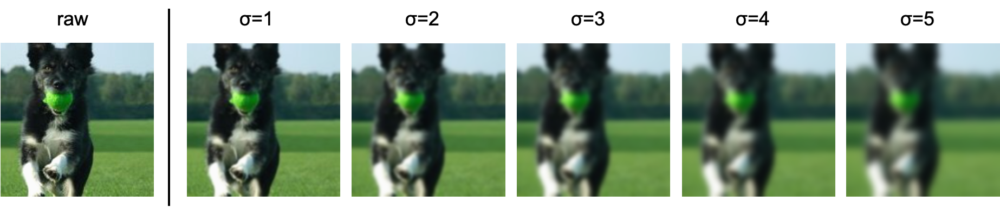

# blur-training
Training CNNs(Convolutional Neural Networks) with blurred images.

## Blurred images (GaussianBlur)
Training images are blurred by Gaussian function. The images are more blurred as std.(σ) of Gaussian kernel is bigger.

## Schedule
You can try different training schedule as for blurring images. Here is an overview of the training schedule:
